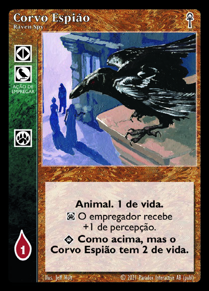
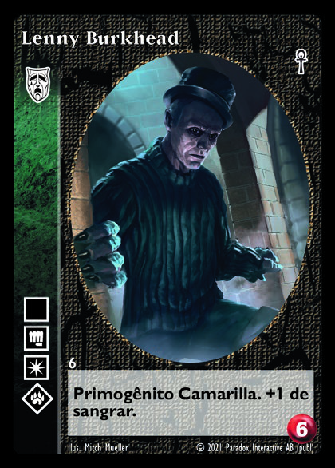
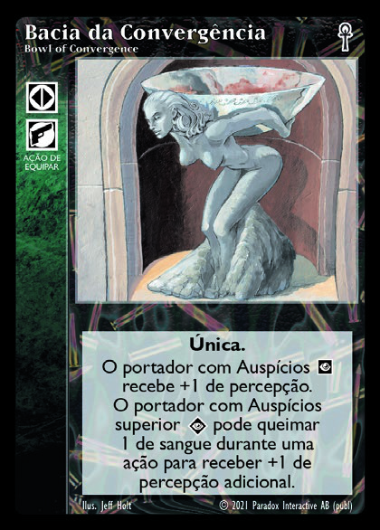
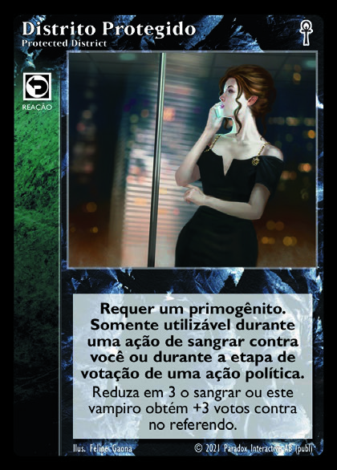
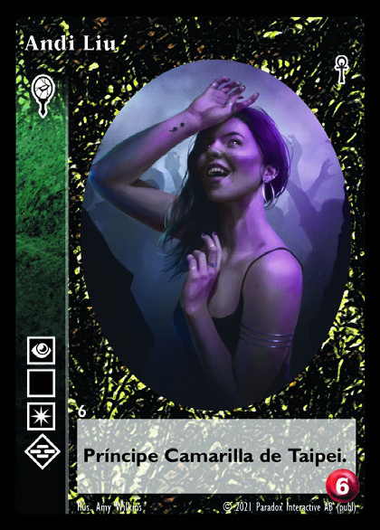
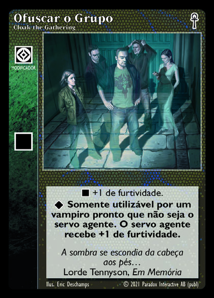
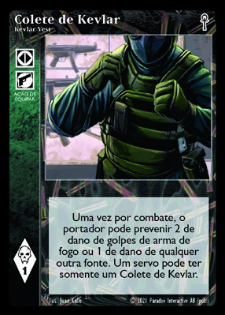
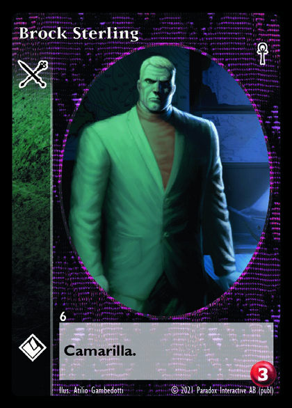

<div align="center">
  
  
  # Jyhhad
  ### Plataforma de Jogos com Tokenomics

  [](LICENSE)
  [](https://unity.com/)
  [](https://ethereum.org/)
  [](https://soliditylang.org/)
  
  <p>
    <a href="#visão-geral">Visão Geral</a> •
    <a href="#estrutura-do-projeto">Estrutura</a> •
    <a href="#objetivo">Objetivo</a> •
    <a href="#componentes-principais">Componentes</a> •
    <a href="#destaque-vtes">VTES</a> •
    <a href="#como-começar">Instalação</a> •
    <a href="#documentação">Documentação</a> •
    <a href="#contribuindo">Contribuições</a>
  </p>
</div>

---

## 🎮 Visão Geral

**Jyhhad** é uma plataforma inovadora que integra jogos clássicos com tokenomics na blockchain Ethereum. Nossa plataforma combina três componentes principais:

- 🎲 **Jyhhad-Chess-Game**: Um jogo de xadrez com tabuleiro hexagonal desenvolvido em Unity
- ⛓️ **SoulEnemySolidity**: Smart contracts para tokenomics e sistema de recompensas
- 🧛‍♂️ **VTES**: Implementação digital do jogo Vampire: The Eternal Struggle

## 📁 Estrutura do Projeto

```
Jyhhad/
├── Jyhhad-Chess-Game/    # Jogo de xadrez hexagonal em Unity
├── soulEnemySolidity/    # Smart contracts Ethereum
├── VTES/                 # Implementação digital do VTES
└── docs/                 # Documentação centralizada
   ├── assets/            # Imagens e recursos visuais
   ├── architecture.md    # Arquitetura do sistema
   ├── tokenomics.md      # Economia e tokens
   └── gameplay.md        # Regras e mecânicas
```

## 🎯 Objetivo

<div align="center">
  <table>
    <tr>
      <td>🎲</td>
      <td><b>Jogabilidade Recompensada</b>: Jogadores ganham tokens ao participar e vencer partidas</td>
    </tr>
    <tr>
      <td>🔓</td>
      <td><b>Conteúdo Exclusivo</b>: Tokens podem ser utilizados para desbloquear itens e recursos especiais</td>
    </tr>
    <tr>
      <td>🏛️</td>
      <td><b>Governança Comunitária</b>: A comunidade participa ativamente das decisões do projeto</td>
    </tr>
    <tr>
      <td>⛓️</td>
      <td><b>Integração Blockchain</b>: Todos os jogos são integrados com a tecnologia blockchain</td>
    </tr>
  </table>
</div>

## 🛠️ Componentes Principais

<details>
  <summary><h3>🎲 Jyhhad-Chess-Game</h3></summary>
  <p>Um jogo de xadrez reimaginado com tabuleiro hexagonal e regras inovadoras.</p>
  <ul>
    <li>🔷 Tabuleiro hexagonal com mecânicas únicas</li>
    <li>🏆 Sistema de recompensas integrado à blockchain</li>
    <li>🖥️ Interface moderna e intuitiva</li>
    <li>🌐 Multiplayer online com sistema de ranking</li>
  </ul>
  <div align="center">
    <i>Em breve: capturas de tela do jogo</i>
  </div>
</details>

<details>
  <summary><h3>⛓️ SoulEnemySolidity</h3></summary>
  <p>Framework de smart contracts para gerenciar a economia do ecossistema Jyhhad.</p>
  <ul>
    <li>💰 Token ERC-20 "Soul of Enemy" (SOE)</li>
    <li>🏆 Sistema de recompensas baseado em desempenho</li>
    <li>🏛️ Smart contracts para governança descentralizada</li>
    <li>🔄 Integração perfeita com todos os jogos da plataforma</li>
  </ul>
  <div align="center">
    <i>Ecossistema de tokens totalmente integrado aos jogos</i>
  </div>
</details>

<details>
  <summary><h3>🧛‍♂️ VTES (Vampire: The Eternal Struggle)</h3></summary>
  <p>Implementação digital completa do clássico jogo de cartas.</p>
  <ul>
    <li>🃏 Implementação digital fiel do jogo de cartas original</li>
    <li>🏆 Sistema de ranking e recompensas em tokens</li>
    <li>💰 Integração com tokenomics</li>
    <li>🌐 Multiplayer online com suporte para 3-5 jogadores</li>
  </ul>
  
  <h4>Exemplos de Cartas</h4>
  <div align="center">
    
    
    
    
  </div>
  
  <div align="center">
    <i>Vampire: The Eternal Struggle é um jogo de cartas estratégico baseado no universo de World of Darkness.</i>
  </div>
</details>

## 🧛‍♂️ Destaque: VTES

<div align="center">
  
</div>

VTES é um jogo de cartas colecionáveis criado por Richard Garfield, o mesmo criador de Magic: The Gathering. Nossa implementação digital traz:

<div align="center">
  <table>
    <tr>
      <td align="center">📜</td>
      <td><b>Mecânicas Fiéis</b>: Mantém todas as regras e mecânicas do jogo original</td>
    </tr>
    <tr>
      <td align="center">🎴</td>
      <td><b>Coleção Completa</b>: Inclui cartas de todas as expansões lançadas</td>
    </tr>
    <tr>
      <td align="center">👥</td>
      <td><b>Multiplayer Nativo</b>: Suporte para jogos de 3-5 jogadores</td>
    </tr>
    <tr>
      <td align="center">🔗</td>
      <td><b>Integração Blockchain</b>: Cartas raras podem ser tokenizadas como NFTs</td>
    </tr>
  </table>
</div>

<div align="center">
  
  
  
  
</div>

## 🚀 Como Começar

### Pré-requisitos
- Unity 2022.3 ou superior
- Node.js v16 ou superior
- MetaMask ou carteira compatível com Ethereum
- Git

### Instalação

```bash
# Clone o repositório
git clone https://github.com/seu-usuario/Jyhhad.git
cd Jyhhad

# Instale as dependências
npm install
```

### Executando os Jogos

<div align="center">
  <table>
    <tr>
      <th>Componente</th>
      <th>Instruções</th>
    </tr>
    <tr>
      <td>Jyhhad-Chess-Game</td>
      <td>Abra o projeto no Unity e execute a cena principal</td>
    </tr>
    <tr>
      <td>SoulEnemySolidity</td>
      <td>
        <code>cd soulEnemySolidity</code><br>
        <code>npx hardhat compile</code><br>
        <code>npx hardhat test</code>
      </td>
    </tr>
    <tr>
      <td>VTES</td>
      <td>
        <code>cd VTES</code><br>
        <code>npm start</code>
      </td>
    </tr>
  </table>
</div>

### Conectando com a Blockchain
1. Configure o MetaMask no seu navegador
2. Conecte sua carteira ao acessar a plataforma
3. Aprove as transações de tokens para começar a jogar

## 📚 Documentação

<div align="center">
  <table>
    <tr>
      <td><a href="docs/architecture.md">📐 Arquitetura</a></td>
      <td>Documentação detalhada sobre a arquitetura do sistema</td>
    </tr>
    <tr>
      <td><a href="docs/tokenomics.md">💰 Tokenomics</a></td>
      <td>Explicação completa sobre a economia de tokens</td>
    </tr>
    <tr>
      <td><a href="docs/gameplay.md">🎮 Gameplay</a></td>
      <td>Regras e mecânicas de todos os jogos da plataforma</td>
    </tr>
  </table>
</div>

## 🤝 Contribuindo

Agradecemos seu interesse em contribuir com o Jyhhad! Siga os passos abaixo:

1. Faça um fork do projeto
2. Crie uma branch para sua feature (`git checkout -b feature/nova-funcionalidade`)
3. Commit suas mudanças (`git commit -m 'Adiciona nova funcionalidade'`)
4. Push para a branch (`git push origin feature/nova-funcionalidade`)
5. Abra um Pull Request

## 📜 Licença

Este projeto está sob a licença MIT. Veja o arquivo [LICENSE](LICENSE) para mais detalhes.

## 👥 Equipe

<div align="center">
  <table>
    <tr>
      <td align="center">
        <a href="https://github.com/maikonweber">
          <br>
          <b>Maikon Weber</b>
        </a><br>
        <small>Desenvolvedor Principal</small>
      </td>
      <td align="center">
        <a href="https://github.com/douglas">
          <br>
          <b>Douglas</b>
        </a><br>
        <small>Desenvolvedor Principal</small>
      </td>
    </tr>
  </table>
</div>

## 🙏 Agradecimentos

- Unity Technologies
- Ethereum Foundation
- Comunidade VTES
- Todos os contribuidores do projeto
