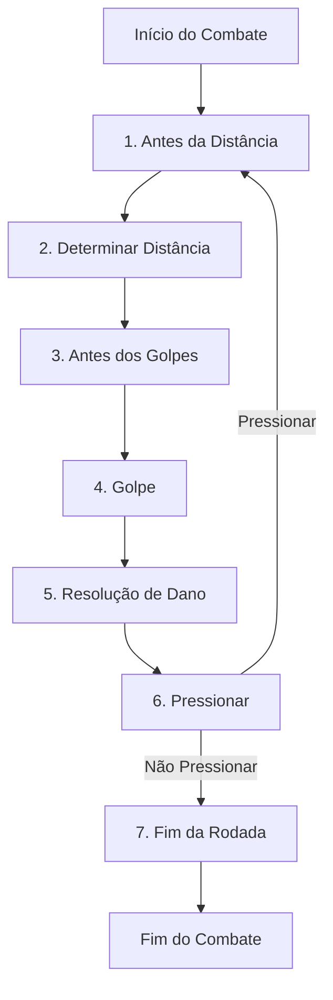

# 🗡️ Sistema de Combate em VTES

## 📜 Visão Geral

O combate em VTES ocorre quando um servo tenta realizar uma ação e é bloqueado por outro servo, ou quando um efeito específico inicia um combate. Este documento detalha as regras e mecânicas do sistema de combate.

## 🔄 Sequência de Combate

O combate ocorre em uma série de uma ou mais rodadas. Cada rodada segue uma sequência específica de sete etapas:

### 1️⃣ Antes da Distância
- Momento para jogar cartas e efeitos que devem ser usados antes de definir a distância
- Claramente indicado nas cartas com texto como "antes que a distância seja determinada"
- O servo agente (aquele que iniciou a ação) sempre tem a primeira oportunidade de jogar cartas

> **Importante**: Os efeitos "antes que a distância seja determinada" devem ser jogados antes que o servo agente decida se irá ou não jogar uma manobra.

### 2️⃣ Determinar a Distância
- Por padrão, o combate começa em **longa distância**
- Servos podem jogar cartas de **manobra** para alterar a distância
- Cada manobra muda a distância para curta ou longa, conforme indicado na carta
- O servo agente decide primeiro se jogará uma manobra
- Em seguida, o servo reagente decide se jogará uma manobra
- A última manobra jogada determina a distância final para esta rodada

#### Tipos de Distância
- **Longa Distância**: Favorece ataques à distância e efeitos defensivos
- **Curta Distância**: Favorece ataques corpo-a-corpo e disciplinas físicas

### 3️⃣ Antes dos Golpes
- Momento para jogar cartas e efeitos que devem ser usados antes da escolha dos golpes
- Indicado nas cartas com texto como "antes de escolher golpes"
- Novamente, o servo agente tem a primeira oportunidade

### 4️⃣ Golpe
- Cada servo escolhe e anuncia um golpe
- O servo agente anuncia primeiro, seguido pelo servo reagente
- Os golpes são resolvidos simultaneamente
- Tipos de golpes incluem:
  - **Ataque**: Causa dano ao oponente
  - **Esquiva**: Evita dano de um ataque
  - **Defesa**: Reduz o dano recebido
  - **Efeito Especial**: Varia conforme a carta

#### Resolução de Golpes
- **Ataque vs. Ataque**: Ambos causam dano
- **Ataque vs. Esquiva**: A esquiva cancela o ataque
- **Ataque vs. Defesa**: O ataque causa dano, possivelmente reduzido
- **Esquiva vs. Esquiva**: Nada acontece
- **Efeitos Especiais**: Resolvidos conforme o texto da carta

### 5️⃣ Resolução de Dano
- O dano é aplicado aos servos
- Jogadores podem usar efeitos para prevenir ou reduzir dano
- Dano não prevenido é aplicado como perda de sangue
- Se um vampiro ficar sem sangue, ele entra em torpor
- Se um aliado ficar sem vida, ele é queimado (removido do jogo)

#### Prevenção de Dano
- Cartas específicas podem prevenir dano
- Cada ponto de prevenção anula um ponto de dano
- A prevenção deve ser jogada imediatamente após o dano ser anunciado

### 6️⃣ Pressionar
- Após a resolução do dano, os servos decidem se continuam o combate
- O servo agente decide primeiro se deseja pressionar
- Se o servo agente pressionar, o servo reagente deve decidir se também pressiona
- Se ambos pressionarem, uma nova rodada de combate começa
- Se qualquer um decidir não pressionar, o combate termina

#### Efeitos de Pressionar
- Algumas cartas têm efeitos especiais que ocorrem ao pressionar
- Estes efeitos são resolvidos antes de iniciar a nova rodada
- Cartas podem forçar ou impedir que um servo pressione

### 7️⃣ Fim da Rodada
- Efeitos que ocorrem no fim da rodada são resolvidos
- Cartas que duram "até o fim da rodada" expiram
- Se o combate continuar, retorna à etapa 1 (Antes da Distância)
- Se o combate terminar, os servos retornam às suas posições anteriores

## 🎯 Tipos de Ataques

### Ataques Físicos
- **Mãos Nuas**: Causa 1 ponto de dano físico
- **Armas**: Causam dano adicional, conforme especificado na carta
- **Mordida**: Causa dano e permite transferir sangue do oponente

### Ataques de Disciplina
- **Potência**: Aumenta o dano físico
- **Rapidez**: Permite esquivas adicionais
- **Fortitude**: Fornece prevenção de dano
- **Outras Disciplinas**: Efeitos variados, conforme as cartas

### Ataques Especiais
- **Frenesi**: Força um vampiro a atacar continuamente
- **Torpor**: Coloca um vampiro em estado de inconsciência
- **Diablerie**: Permite destruir permanentemente um vampiro em torpor

## 🛡️ Estratégias de Combate

### Para Longa Distância
- Use armas de alcance
- Priorize disciplinas que funcionam à distância
- Mantenha cartas de manobra para garantir a distância desejada

### Para Curta Distância
- Use armas corpo-a-corpo
- Priorize disciplinas físicas
- Tenha cartas de manobra para fechar a distância

### Defensivas
- Mantenha cartas de esquiva
- Tenha fontes de prevenção de dano
- Use efeitos que terminam o combate prematuramente

### Ofensivas
- Maximize o dano potencial
- Use efeitos que impedem esquivas
- Tenha cartas para forçar rodadas adicionais

## 📋 Regras Especiais

### Torpor
- Um vampiro entra em torpor quando fica sem sangue
- Vampiros em torpor são colocados na região de torpor
- Eles não podem agir, mas podem ser resgatados ou destruídos
- Para resgatar um vampiro em torpor, outro vampiro deve gastar uma ação e sangue

### Diablerie
- Permite destruir permanentemente um vampiro em torpor
- O diablerista (vampiro que realiza a diablerie) ganha benefícios
- É considerado uma violação grave das leis vampíricas
- Pode resultar em penalidades sociais dentro do jogo

### Frenesi
- Estado de fúria incontrolável
- Vampiros em frenesi devem atacar e pressionar sempre que possível
- Certas disciplinas ou efeitos podem causar ou prevenir frenesi

## 🎮 Dicas Táticas

1. **Conheça seu deck**: Entenda as forças e fraquezas dos seus vampiros
2. **Gerencie recursos**: O sangue é limitado, use-o sabiamente
3. **Antecipe o oponente**: Tente prever os golpes do adversário
4. **Mantenha opções**: Tenha cartas para diferentes situações de combate
5. **Timing é crucial**: Saiba quando pressionar e quando recuar 