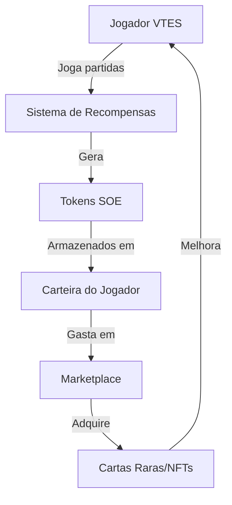

# 🔄 Integração VTES e Tokenomics

## 📊 Visão Geral

Este documento explica como o jogo VTES (Vampire: The Eternal Struggle) se integra ao ecossistema de tokenomics do projeto Jyhhad, utilizando o token SOE (Soul of Enemy) como moeda principal.

## 💎 Recompensas em Tokens

### Ações Recompensadas
| Ação | Recompensa (SOE) | Frequência |
|------|------------------|------------|
| Vitória em partida | 5-30 | Por partida |
| Participação | 2-10 | Por partida |
| Eliminação de presa | 15-25 | Por eliminação |
| Torneio (1º lugar) | 100-500 | Por torneio |
| Conquistas diárias | 3-15 | Diária |
| Coleção completa de clã | 200-2000 | Única |

### Multiplicadores
- **Streak de vitórias**: +10% por vitória consecutiva (máx. 50%)
- **Eventos especiais**: +25% durante eventos temáticos
- **Bônus de clã**: +5% ao jogar com o clã do mês

## 🃏 NFTs e Cartas Colecionáveis

### Tipos de NFTs
1. **Cartas Raras**
  - Versões especiais de cartas existentes
  - Efeitos visuais únicos
  - Algumas com habilidades exclusivas para modo casual

2. **Itens Cosméticos**
  - Designs de tabuleiro
  - Marcadores de sangue personalizados
  - Animações de efeitos

3. **Títulos e Emblemas**
  - Títulos exclusivos para perfil
  - Emblemas de conquistas
  - Indicadores de status

### Raridade e Distribuição
- **Comum**: 65% de chance em pacotes
- **Incomum**: 25% de chance em pacotes
- **Rara**: 8% de chance em pacotes
- **Mítica**: 2% de chance em pacotes
- **Lendária**: Apenas em eventos especiais ou marketplace

## 🛒 Marketplace

### Funcionalidades
- Compra/venda de cartas entre jogadores
- Leilões de itens raros
- Pacotes de cartas (boosters)
- Itens cosméticos exclusivos

### Preços de Referência
| Item | Preço (SOE) | Disponibilidade |
|------|-------------|----------------|
| Pacote básico | 50-100 | Sempre |
| Pacote premium | 200-500 | Sempre |
| Carta rara | 200-1000 | Variável |
| Carta mítica | 1000-5000 | Limitada |
| Carta lendária | 5000-20000 | Muito rara |
| Cosmético básico | 50-200 | Sempre |
| Cosmético exclusivo | 500-2000 | Limitada |

### Taxas de Transação
- **Taxa de listagem**: 1% (mínimo 5 SOE)
- **Taxa de venda**: 2.5% (queima de 1%, liquidez de 1%, desenvolvimento de 0.5%)
- **Taxa de transferência direta**: 1% (queima de 0.5%, liquidez de 0.5%)

## 🎮 Mecânicas de Jogo Exclusivas

### Modo Stake-to-Play
- Jogadores podem apostar tokens em partidas
- Vencedor leva 90% do pool (10% para queima/liquidez)
- Diferentes níveis de aposta (iniciante, intermediário, expert)

### Torneios com Entrada em Tokens
- Entrada paga em tokens SOE
- Pool de prêmios distribuído entre os melhores colocados
- Torneios semanais, mensais e sazonais

### Cartas Exclusivas para Holders
- Holders de determinada quantidade de SOE desbloqueiam cartas exclusivas
- Tiers de recompensas baseados na quantidade de tokens
- Staking de tokens para acesso a cartas premium

## 📈 Economia Sustentável

### Mecanismos de Emissão
- Recompensas de jogo: emissão controlada
- Eventos especiais: emissão limitada
- Conquistas: emissão única por conta

### Mecanismos de Queima
- Taxas de marketplace
- Compra de pacotes
- Entrada em torneios
- Upgrade de cartas

### Equilíbrio Econômico
- Ajustes dinâmicos de recompensas baseados na inflação do token
- Eventos de queima periódicos
- Novos sumidouros de tokens introduzidos regularmente

## 🔐 Segurança e Fairplay

### Anti-Cheating
- Sistema de detecção de conluio
- Verificação de partidas legítimas
- Penalidades para manipulação de partidas

### Proteção de Ativos
- Backup de NFTs
- Sistema de recuperação de conta
- Autenticação de dois fatores

### Governança
- Votações sobre novas cartas e mecânicas
- Ajustes de recompensas
- Propostas de eventos especiais

## 🚀 Roadmap de Integração

### Fase 1: Fundação
- Sistema básico de recompensas
- Marketplace com funcionalidades essenciais
- Primeiras cartas NFT

### Fase 2: Expansão
- Torneios com entrada em tokens
- Sistema de staking
- Cartas exclusivas para holders

### Fase 3: Maturidade
- Governança completa
- Modo competitivo com apostas
- Integração cross-chain 