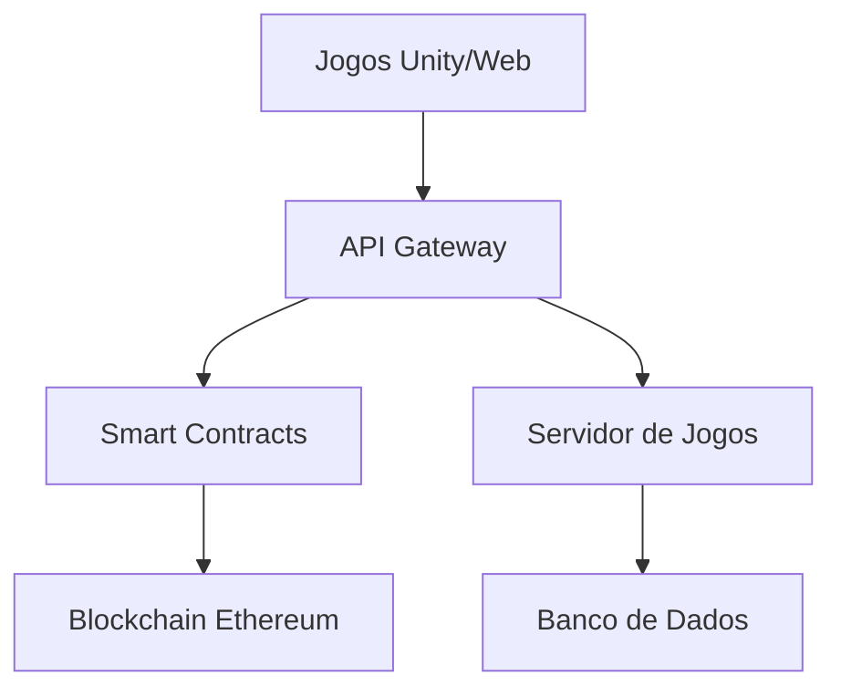

# Arquitetura do Sistema Jyhhad

## Visão Geral da Arquitetura

O sistema Jyhhad é composto por três componentes principais que se integram para criar uma experiência de jogo descentralizada:

### 1. Camada de Jogos
- **Jyhhad-Chess-Game**: Implementado em Unity
- **VTES**: Implementado como aplicação web
- Ambos se comunicam com a blockchain através de Web3.js

### 2. Camada Blockchain
- **SoulEnemySolidity**: Smart contracts em Solidity
- Token ERC-20 para recompensas
- Sistema de governança descentralizado

### 3. Camada de Integração
- Web3.js para comunicação com a blockchain
- APIs REST para comunicação entre jogos
- Sistema de autenticação descentralizado

## Fluxo de Dados

## Componentes Principais

### 1. Sistema de Jogos
- **Unity Game Engine**
  - Renderização 3D
  - Física do jogo
  - Sistema de input
  - Networking

- **Servidor de Jogos**
  - Matchmaking
  - Estado do jogo
  - Persistência de dados
  - Sistema de ranking

### 2. Sistema Blockchain
- **Smart Contracts**
  - Token ERC-20
  - Sistema de recompensas
  - Governança
  - Marketplace

- **Integração Web3**
  - Conexão com carteiras
  - Transações
  - Eventos
  - Estado da blockchain

### 3. Sistema de Integração
- **API Gateway**
  - Autenticação
  - Rate limiting
  - Cache
  - Load balancing

- **Serviços de Suporte**
  - Analytics
  - Logging
  - Monitoramento
  - Backup

## Segurança

### 1. Autenticação
- Login com carteira Ethereum
- JWT para sessões
- 2FA opcional

### 2. Proteção de Dados
- Criptografia em trânsito
- Armazenamento seguro
- Backup regular
- Conformidade com LGPD

### 3. Smart Contracts
- Auditorias regulares
- Testes automatizados
- Upgrade patterns
- Emergency stops

## Escalabilidade

### 1. Horizontal
- Load balancing
- Sharding de dados
- CDN para assets
- Caching distribuído

### 2. Vertical
- Otimização de queries
- Indexação eficiente
- Compressão de dados
- Resource pooling

## Monitoramento

### 1. Métricas
- Uptime
- Latência
- Throughput
- Erros

### 2. Logs
- Acesso
- Transações
- Erros
- Performance

### 3. Alertas
- Thresholds
- Anomalias
- Security
- Business metrics 