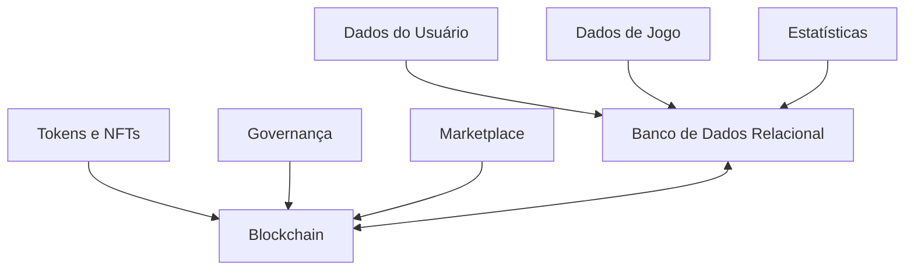

# 🗃️ Estrutura de Banco de Dados - Projeto Jyhhad

## 📊 Visão Geral

O projeto Jyhhad utiliza uma combinação de armazenamento on-chain (blockchain) e off-chain (banco de dados tradicional) para gerenciar seus dados. Esta estrutura híbrida permite balancear segurança, descentralização e performance.



## 🔗 Estrutura On-Chain

### Contratos Principais

#### 1. SoulEnemyToken (ERC-20)
```solidity
contract SoulEnemyToken is ERC20, Ownable {
   // Propriedades principais
   string public constant name = "Soul of Enemy";
   string public constant symbol = "SOE";
   uint8 public constant decimals = 18;
   uint256 public constant initialSupply = 1_000_000_000 * 10**18;
   
   // Taxa de queima
   uint256 public burnRate = 200; // 2%
   
   // Mapeamentos
   mapping(address => bool) public excludedFromFees;
   mapping(address => bool) public gameContracts;
}
```

#### 2. GameRewards
```solidity
contract GameRewards {
   // Estruturas
   struct Reward {
      uint256 amount;
      uint256 timestamp;
      string gameId;
      string reason;
   }
   
   // Mapeamentos
   mapping(address => Reward[]) public userRewards;
   mapping(string => uint256) public rewardRates;
}
```

#### 3. NFTItems
```solidity
contract NFTItems is ERC721 {
   // Estruturas
   struct Item {
      string itemType; // "skin", "board", "card", etc.
      string gameId;
      uint256 rarity;
      string metadata;
   }
   
   // Mapeamentos
   mapping(uint256 => Item) public items;
}
```

#### 4. Governance
```solidity
contract Governance {
   // Estruturas
   struct Proposal {
      uint256 id;
      address proposer;
      string description;
      uint256 forVotes;
      uint256 againstVotes;
      uint256 startTime;
      uint256 endTime;
      bool executed;
   }
   
   // Mapeamentos
   mapping(uint256 => Proposal) public proposals;
   mapping(address => mapping(uint256 => bool)) public hasVoted;
}
```

## 📁 Estrutura Off-Chain

### Tabelas Principais

#### 1. Users
| Campo | Tipo | Descrição |
|-------|------|-----------|
| id | UUID | Identificador único |
| wallet_address | VARCHAR(42) | Endereço Ethereum |
| username | VARCHAR(50) | Nome de usuário |
| email | VARCHAR(100) | Email (opcional) |
| created_at | TIMESTAMP | Data de criação |
| last_login | TIMESTAMP | Último login |
| profile_image | VARCHAR(255) | URL da imagem de perfil |
| xp | INTEGER | Experiência total |
| level | INTEGER | Nível do usuário |

#### 2. Game_Sessions
| Campo | Tipo | Descrição |
|-------|------|-----------|
| id | UUID | Identificador único |
| game_id | VARCHAR(20) | Identificador do jogo (chess/vtes) |
| start_time | TIMESTAMP | Início da sessão |
| end_time | TIMESTAMP | Fim da sessão |
| status | VARCHAR(20) | Em andamento/Finalizada/Cancelada |
| winner_id | UUID | ID do vencedor (se houver) |
| session_data | JSONB | Dados específicos da sessão |

#### 3. Game_Players
| Campo | Tipo | Descrição |
|-------|------|-----------|
| session_id | UUID | ID da sessão |
| user_id | UUID | ID do usuário |
| position | INTEGER | Posição no jogo |
| score | INTEGER | Pontuação |
| result | VARCHAR(20) | Vitória/Derrota/Empate |
| reward_amount | DECIMAL | Recompensa em tokens |
| reward_tx_hash | VARCHAR(66) | Hash da transação de recompensa |

#### 4. Chess_Games
| Campo | Tipo | Descrição |
|-------|------|-----------|
| session_id | UUID | ID da sessão |
| board_state | JSONB | Estado do tabuleiro |
| moves | JSONB[] | Lista de movimentos |
| time_control | VARCHAR(50) | Controle de tempo |
| variant | VARCHAR(20) | Variante (hexagonal) |

#### 5. VTES_Games
| Campo | Tipo | Descrição |
|-------|------|-----------|
| session_id | UUID | ID da sessão |
| game_state | JSONB | Estado do jogo |
| turn_number | INTEGER | Número do turno atual |
| prey_predator | JSONB | Relações presa-predador |
| blood_bank | INTEGER | Sangue no banco |

#### 6. User_Inventories
| Campo | Tipo | Descrição |
|-------|------|-----------|
| user_id | UUID | ID do usuário |
| item_type | VARCHAR(20) | Tipo de item |
| token_id | INTEGER | ID do token NFT (se aplicável) |
| game_id | VARCHAR(20) | ID do jogo |
| acquired_at | TIMESTAMP | Data de aquisição |
| metadata | JSONB | Metadados do item |

#### 7. Achievements
| Campo | Tipo | Descrição |
|-------|------|-----------|
| id | UUID | Identificador único |
| name | VARCHAR(100) | Nome da conquista |
| description | TEXT | Descrição |
| game_id | VARCHAR(20) | ID do jogo |
| criteria | JSONB | Critérios para desbloquear |
| reward_amount | DECIMAL | Recompensa em tokens |
| icon_url | VARCHAR(255) | URL do ícone |

#### 8. User_Achievements
| Campo | Tipo | Descrição |
|-------|------|-----------|
| user_id | UUID | ID do usuário |
| achievement_id | UUID | ID da conquista |
| unlocked_at | TIMESTAMP | Data de desbloqueio |
| reward_claimed | BOOLEAN | Recompensa reivindicada |
| reward_tx_hash | VARCHAR(66) | Hash da transação de recompensa |

#### 9. Marketplace_Listings
| Campo | Tipo | Descrição |
|-------|------|-----------|
| id | UUID | Identificador único |
| seller_id | UUID | ID do vendedor |
| token_id | INTEGER | ID do token NFT |
| price | DECIMAL | Preço em SOE |
| listed_at | TIMESTAMP | Data de listagem |
| status | VARCHAR(20) | Ativo/Vendido/Cancelado |
| buyer_id | UUID | ID do comprador (se vendido) |
| transaction_hash | VARCHAR(66) | Hash da transação |

## 🔄 Sincronização On-Chain/Off-Chain

### Eventos Blockchain Monitorados
- `Transfer` (ERC-20/ERC-721)
- `RewardDistributed`
- `ItemMinted`
- `MarketplaceSale`
- `ProposalCreated`
- `VoteCast`

### Serviços de Sincronização
1. **Indexador de Eventos**: Monitora eventos da blockchain e atualiza o banco de dados
2. **Serviço de Recompensas**: Calcula e distribui recompensas
3. **Verificador de Transações**: Confirma transações e atualiza status

## 📈 Índices e Performance

### Índices Principais
- `users(wallet_address)`
- `game_sessions(game_id, status)`
- `game_players(user_id, session_id)`
- `user_inventories(user_id, item_type)`
- `marketplace_listings(status, token_id)`

### Estratégias de Otimização
1. **Particionamento**: Tabelas de sessões de jogo particionadas por mês
2. **Caching**: Cache de inventário e conquistas do usuário
3. **Compressão**: Compressão de dados JSONB para estados de jogo
4. **Arquivamento**: Movimentação de sessões antigas para tabelas de arquivo

## 🔒 Segurança e Backup

### Estratégia de Backup
- Backups completos diários
- Backups incrementais a cada 6 horas
- Retenção de 30 dias
- Armazenamento em múltiplas regiões

### Segurança
- Criptografia de dados sensíveis
- Autenticação via assinatura de mensagens Ethereum
- Logs de auditoria para todas as operações críticas
- Monitoramento de atividades suspeitas 