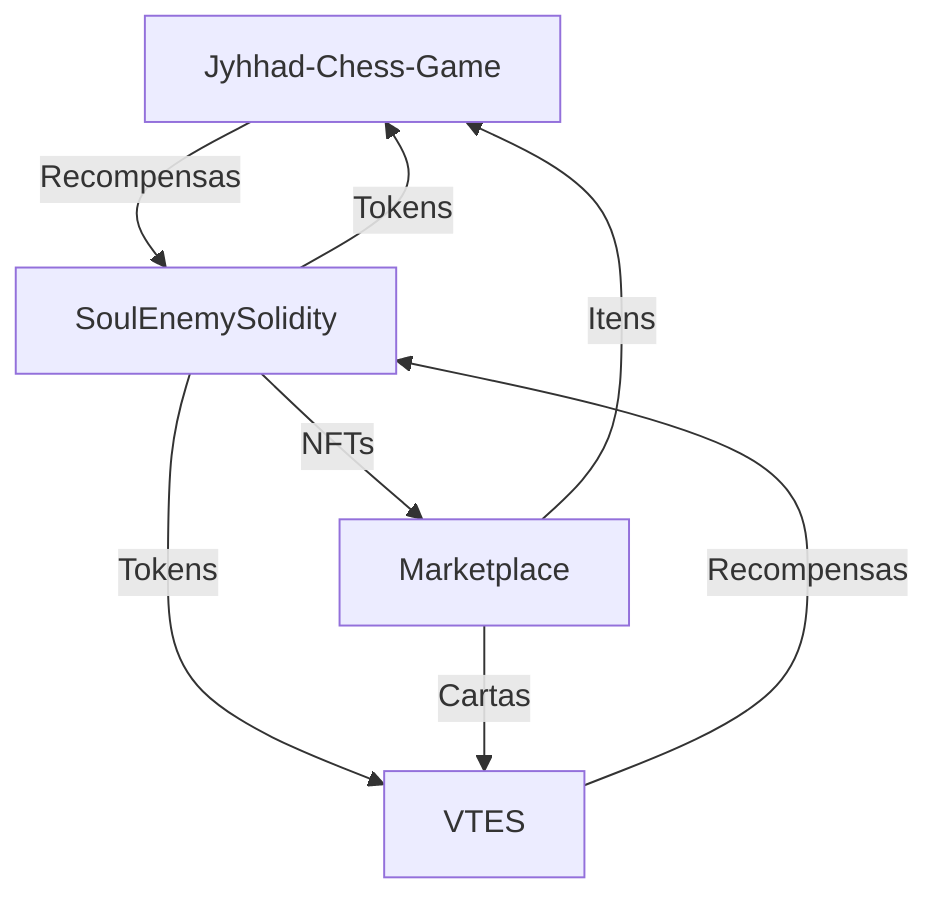

# 🔄 Integração entre os Componentes do Jyhhad

## 📊 Visão Geral da Integração

O projeto Jyhhad é composto por três componentes principais que se integram para criar uma experiência de jogo descentralizada com tokenomics. Este documento explica como esses componentes se complementam e funcionam juntos.

## 🧩 Componentes e suas Funções

### 1. Jyhhad-Chess-Game
- **Função Principal**: Jogo de xadrez com tabuleiro hexagonal em Unity
- **Público-alvo**: Jogadores de xadrez e estratégia
- **Contribuição para o Ecossistema**: 
  - Ponto de entrada para jogadores de estratégia
  - Geração de tokens através de partidas e torneios
  - Consumo de tokens para itens cosméticos e funcionalidades premium

### 2. SoulEnemySolidity
- **Função Principal**: Infraestrutura blockchain e tokenomics
- **Público-alvo**: Todos os usuários da plataforma
- **Contribuição para o Ecossistema**:
  - Emissão e gestão do token SOE
  - Contratos inteligentes para recompensas
  - Sistema de governança
  - Marketplace para itens dos jogos

### 3. VTES
- **Função Principal**: Jogo de cartas colecionáveis digital
- **Público-alvo**: Fãs de jogos de cartas e do universo Vampire
- **Contribuição para o Ecossistema**:
  - Diversificação da oferta de jogos
  - Geração de tokens através de partidas e coleções
  - Consumo de tokens para cartas raras e eventos especiais

## 🔄 Fluxos de Integração

### 1. Fluxo de Recompensas
1. **Geração de Recompensas**:
  - Jogadores participam de partidas em Jyhhad-Chess-Game ou VTES
  - O sistema registra vitórias, achievements e participação
  - Smart contracts calculam as recompensas devidas

2. **Distribuição de Tokens**:
  - Tokens SOE são transferidos para a carteira do jogador
  - Eventos especiais podem conceder bônus ou multiplicadores
  - Torneios oferecem recompensas maiores

### 2. Fluxo de Marketplace
1. **Criação de Itens**:
  - Desenvolvedores criam skins, tabuleiros, cartas e outros itens
  - Itens são tokenizados como NFTs na blockchain
  - Raridade e atributos são definidos nos metadados

2. **Compra e Venda**:
  - Jogadores usam tokens SOE para comprar itens
  - Jogadores podem revender itens no marketplace
  - Parte das taxas de transação é queimada (deflação)

### 3. Fluxo de Governança
1. **Propostas**:
  - Jogadores com tokens suficientes podem criar propostas
  - Propostas podem incluir novos jogos, ajustes de recompensas, etc.

2. **Votação**:
  - Comunidade vota usando tokens SOE
  - Decisões são implementadas via smart contracts

## 🔗 Pontos de Integração Técnica

### 1. Web3 e Carteiras
- **Autenticação Unificada**:
  - Login com MetaMask ou carteira compatível
  - Mesmo login para todos os jogos da plataforma
  - Perfil e inventário compartilhados

- **Transações**:
  - Assinatura de transações para recompensas
  - Aprovações para marketplace
  - Votação em propostas de governança

### 2. API Gateway
- **Comunicação entre Jogos**:
  - Endpoints REST para dados de jogador
  - Webhooks para eventos importantes
  - Cache para dados frequentemente acessados

- **Serviços Compartilhados**:
  - Sistema de amigos
  - Notificações
  - Rankings globais

### 3. Smart Contracts
- **Contratos Principais**:
  - Token ERC-20 (SOE)
  - NFTs ERC-721 para itens únicos
  - Contratos de recompensas
  - Sistema de governança

- **Interoperabilidade**:
  - Oráculos para dados externos
  - Bridges para outras blockchains (futuro)
  - Layer 2 para escalabilidade

## 📈 Benefícios da Integração

### 1. Para Jogadores
- **Economia Compartilhada**: Tokens ganhos em um jogo podem ser usados em outro
- **Perfil Unificado**: Progresso e conquistas centralizados
- **Propriedade Real**: Itens como NFTs pertencem verdadeiramente aos jogadores

### 2. Para Desenvolvedores
- **Base de Usuários Compartilhada**: Jogadores de um jogo podem experimentar o outro
- **Infraestrutura Comum**: Redução de custos de desenvolvimento
- **Tokenomics Sustentável**: Sistema de queima e recompensas balanceado

### 3. Para o Ecossistema
- **Efeito de Rede**: Cada novo jogo ou usuário aumenta o valor da plataforma
- **Governança Descentralizada**: Comunidade decide o futuro da plataforma
- **Sustentabilidade**: Modelo econômico de longo prazo

## 🚀 Roadmap de Integração

### Fase 1: Fundação (Atual)
- Implementação básica dos três componentes
- Integração inicial de carteiras
- Sistema de recompensas simples

### Fase 2: Expansão
- Marketplace completo
- Sistema de perfil unificado
- Eventos cross-game

### Fase 3: Maturidade
- Governança DAO completa
- Múltiplos jogos adicionais
- Interoperabilidade com outros projetos blockchain 