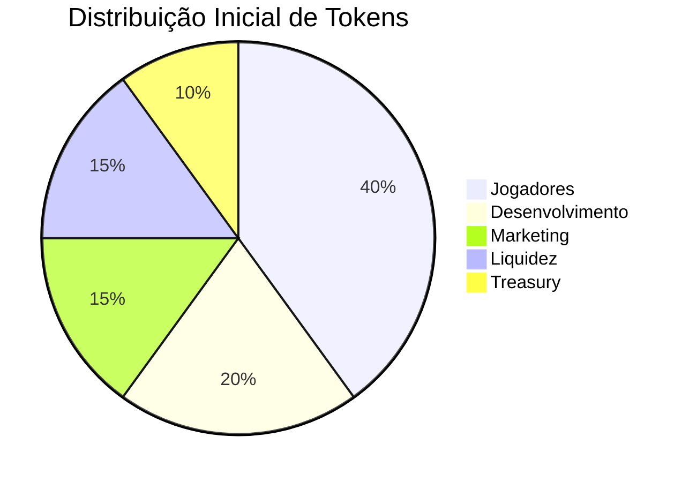

# Tokenomics do Jyhhad

## Visão Geral do Token

O token "Soul of Enemy" (SOE) é o token nativo da plataforma Jyhhad, implementado como um token ERC-20 na blockchain Ethereum.

### Especificações Técnicas
- **Nome**: Soul of Enemy
- **Símbolo**: SOE
- **Decimais**: 18
- **Rede**: Ethereum
- **Padrão**: ERC-20
- **Supply Inicial**: 1,000,000,000 SOE
- **Taxa de Queima**: 2% por transação

## Distribuição Inicial

### Detalhamento
1. **Jogadores (40%)**
  - Recompensas de jogo
  - Eventos especiais
  - Torneios
  - Achievements

2. **Desenvolvimento (20%)**
  - Desenvolvimento de novos jogos
  - Manutenção da plataforma
  - Pesquisa e desenvolvimento

3. **Marketing (15%)**
  - Campanhas publicitárias
  - Parcerias
  - Influencers
  - Eventos comunitários

4. **Liquidez (15%)**
  - Pools de liquidez
  - Market making
  - Estabilidade de preço

5. **Treasury (10%)**
  - Reserva estratégica
  - Emergências
  - Governança

## Mecânicas de Recompensa

### 1. Jyhhad-Chess-Game
- **Vitórias**: 10-50 SOE
- **Ranking**: 5-20 SOE/dia
- **Achievements**: 100-1000 SOE
- **Torneios**: 500-5000 SOE

### 2. VTES
- **Partidas**: 5-30 SOE
- **Ranking**: 3-15 SOE/dia
- **Coleções**: 200-2000 SOE
- **Eventos**: 300-3000 SOE

## Sistema de Queima

### 1. Taxa de Queima
- 2% de cada transação
- 1% para liquidez
- 1% para queima

### 2. Mecânicas de Queima
- Transações P2P
- Compras no marketplace
- Taxas de jogo
- Eventos especiais

## Governança

### 1. Proposta de Votação
- Mínimo de 100,000 SOE
- Período de 7 dias
- Quorum de 5% do supply

### 2. Áreas de Governança
- Novos jogos
- Taxas de recompensa
- Parcerias
- Desenvolvimento

## Marketplace

### 1. Itens Disponíveis
- Skins de peças
- Tabuleiros especiais
- Cartas raras
- Emotes e efeitos

### 2. Preços
- Skins: 100-1000 SOE
- Tabuleiros: 500-5000 SOE
- Cartas: 200-20000 SOE
- Emotes: 50-500 SOE

## Roadmap de Tokenomics

### Fase 1 (Ano 1)
- Lançamento do token
- Distribuição inicial
- Marketplace básico
- Recompensas de jogo

### Fase 2 (Ano 2)
- Sistema de staking
- Governança
- Novos jogos
- Parcerias

### Fase 3 (Ano 3)
- Cross-chain bridges
- NFTs
- Metaverse
- DAO completa

## Análise de Risco

### 1. Riscos Identificados
- Volatilidade de preço
- Manipulação de mercado
- Ataques de smart contract
- Regulamentação

### 2. Mitigações
- Taxa de queima
- Vesting schedules
- Auditorias
- Compliance legal 